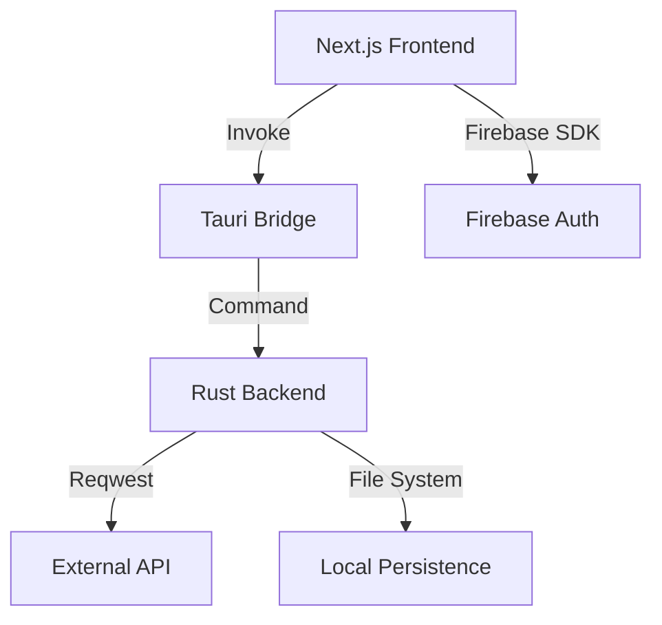

# Cosmonaut Project Documentation

Cosmonaut is a high-performance, professional-grade desktop API client built with Next.js and Tauri. It offers a Postman-like experience with a modern, "liquid glass" aesthetic and native request execution.

## 🏗 High-Level Architecture

Cosmonaut follows a modern desktop application architecture that separates the UI layer from the native execution layer.

### 🌓 Frontend (Next.js + Tailwind CSS)
The frontend serves as the command center, managing the user interface, tab lifecycle, and request preparation.
- **State Management**: Uses React Context API (`CollectionsProvider`, `SettingsProvider`, `AuthProvider`) for global application state.
- **Tab System**: Sophisticated tab management in `WorkspacePage`, allowing multiple concurrent request editors.
- **Request Preparation**: Logic in `RequestPanel` handles URL normalization, parameter appending, and header/auth generation.

### 🦀 Backend (Tauri + Rust)
The backend provides native capabilities that go beyond standard browser limitations.
- **Request Execution**: Uses `reqwest` for high-performance, native HTTP execution, bypassing CORS and other browser constraints.
- **Local Persistence**: Manages the storage and retrieval of workspaces, collections, and history directly on the user's disk.
- **User Scoping**: All data is strictly siloed by Firebase User ID and Workspace ID.

---

## 📂 Project Structure

### Frontend (`/app`)
- `/components`: Core UI components and providers.
  - `CollectionsProvider.tsx`: Central hub for collections, workspaces, and history state.
  - `RequestEngine.ts`: The bridge for executing requests via Tauri.
  - `RequestPanel.tsx`: The primary editor orchestrating request preparation.
  - `RequestBuilderTabs.tsx`: Individual modules for Params, Auth, Headers, and Body.
  - `WorkspaceSidebar.tsx`: Navigation for collections and history.
- `/lib`: Pure utility logic for data structures and bridges.
- `/workspace`: The main dashboard and request builder view.

### Backend (`/src-tauri`)
- `src/lib.rs`: The heart of the native side, containing all Tauri commands.
- `Cargo.toml`: Rust dependencies (`reqwest`, `serde`, `tokio`).

---

## 🔄 Core Flows

### 1. Request Execution Flow (End-to-End)
1. **User Action**: User clicks "Send" in `RequestPanel`.
2. **Normalization**: `RequestPanel` merges params into the URL, generates `Authorization` headers from the `AuthTab` state, and validates the JSON body.
3. **Frontend Bridge**: `RequestEngine.ts` calls `invoke("execute_cosmo_request", { request })`.
4. **Native Execution**: The Rust command in `lib.rs` receives the structured request, builds a `reqwest::Client`, and performs the HTTP call.
5. **Collection/History**: Upon receiving a response, the backend returns it to the frontend, which then records the transaction in the history via `save_history`.

### 2. Local Persistence Flow
- **Scoping**: Data is stored in the application's data directory:
  - `workspaces.json`: Global list of workspaces for a user.
  - `{workspace_id}/collections.json`: Requests grouped by collections.
  - `{workspace_id}/history.json`: Recent request logs.
- **Rehydration**: On app start or workspace switch, `CollectionsProvider` triggers `load_collections` and `load_history` commands, populating the UI state.

---

## 🛠 Architectural Decisions

### Why Tauri?
- **Native Performance**: `reqwest` provides faster and more reliable HTTP execution than browser-based `fetch`.
- **CORS Freedom**: Native requests are not bound by browser Cross-Origin Resource Sharing policies.
- **Local First**: Direct access to the filesystem allows for robust, offline-first data persistence.

### Separation of Concerns
- **Execution vs. Saving**: Requests are executed as ephemeral "missions," but explicitly saved to "Collections" for permanence. History captures everything automatically.
- **Normalization Strategy**: The UI handles user-intent (e.g., Auth type), while the prepare logic converges this into standard HTTP artifacts (Headers/URL) before shipping to Rust.

---

## 📊 Design System
Cosmonaut employs a **Liquid Glass** aesthetic:
- **Themes**: Full support for system-synced light and dark modes.
- **Visual Cues**: Method-specific color coding (GET/Emerald, POST/Amber, etc.).
- **Interactive Elements**: Micro-animations and backdrop blurs to provide a premium feel.

---

## 🚀 Potential Improvements
- **Environment Variables**: Implementing a system for managing staging vs. production variables.
- **Pre-request Scripts**: Adding a sandbox for JavaScript execution before requests.
- **Native Importers**: Support for importing Postman collections or OpenAPI specs directly via Rust.
